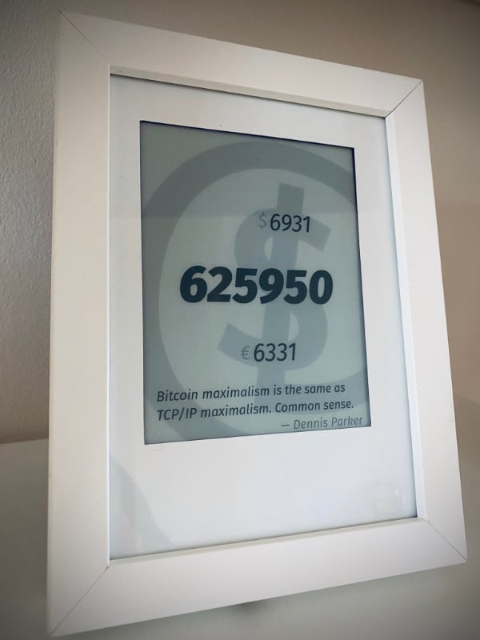
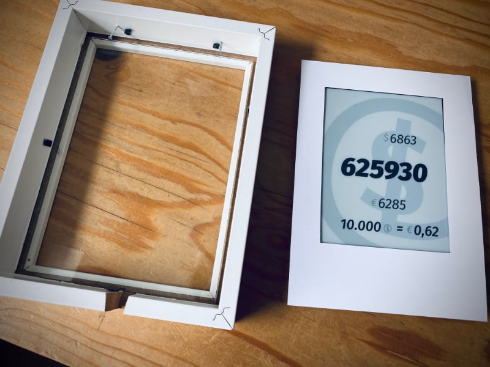
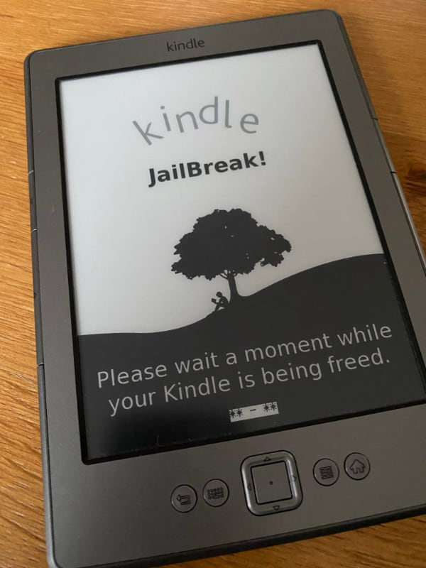
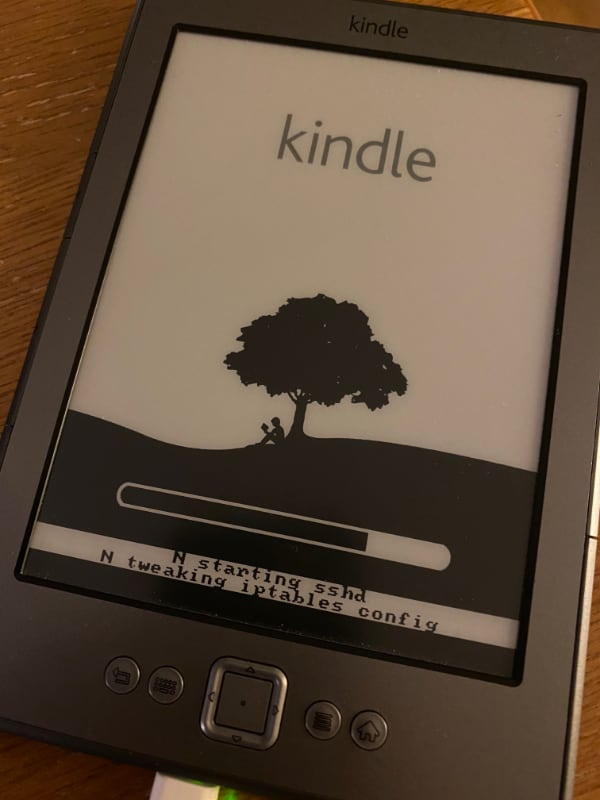

# Kindle Status Display

Original idea and setup taken from [@naltatis' kindle-display](https://github.com/naltatis/kindle-display).



## General

This is a two part setup:
The hacked Kindle pulls a screenshot that is taken from the webpage the server displays.
The server updates this screenshot in regular intervals and the Kindle also updates regularly.

```
+------+   update X minutes    +------+
|      |  ------------------>  |      |
|      |         wifi          |      |
|      |  <------------------  |      |
+------+    greyscale image    +------+
 kindle                         server
```

## Server

The code in this repository is my personal setup which pulls in data from my own network.
I recommend you **fork this repository** and modify the `./data.sh` and visual representation to fit your needs.

### Prerequisites

- Node.js (assembles the data and runs the webserver)
- firefox (takes the screenshot of the webpage)
- pngcrush (converts the screenshot to a greyscale image)
- jo / jq (to generate the JSON data file)

### Installation

```bash
# Clone the repository
git clone git@github.com:username/kindle-display.git

# Go to the server directory
cd kindle-display/server

# Install the dependencies
npm install

# Start the server
npm start

# Update data and create the screenshot
./cron.sh

# Preview the greyscale in your browser
open http://localhost:3030/display.png
```

Once everything works, deploy the server app and setup a cronjob to trigger the `cron.sh` script regularly.

## Kindle

### Prerequisites

You need to
[jailbreak your Kindle](https://wiki.mobileread.com/wiki/Kindle4NTHacking#Jailbreak) using the packages from the
[mobileread forum](https://www.mobileread.com/forums/showthread.php?t=225030).

I installed these according to the info in their particular READMEs:

1. Jailbreak
2. USBNetwork
3. MKK
4. KUAL

### Installation

```bash
# Connect your Kindle via usb and ssh into it
ssh root@kindle

# Make the Kindle file system writable
mntroot rw

# Create the mnt/base-us scripts according to the files in the kindle directory
vi /mnt/base-us/RUNME.sh

# Set the BASE according to your local network setup to address the server
vi /mnt/base-us/update.sh

# Create a cronjob to run the update script in regular intervals
#
# For instance:
# */5 6-22 * * * /mnt/us/update.sh
# 0 23,0,5 * * * /mnt/us/update.sh
vi /etc/crontab/root

# Execute the init script and trigger an the first render
sh /mnt/base-us/RUNME.sh
```

## Images







## Credits

naltatis

- [Original repository](https://github.com/naltatis/kindle-display)

Matthew Petroff

- [Blogpost: Kindle Weather Display](http://mpetroff.net/2012/09/kindle-weather-display/)
- [Github: mpetroff/kindle-weather-display](https://github.com/mpetroff/kindle-weather-display)

hahabird

- [Blogpost: Kindle Weather and Recycling Display](http://hackaday.com/2013/04/01/kindle-weather-and-recycling-display/)
- [Imgur: Pictures of Wodden Frame](http://imgur.com/a/17Y89)
